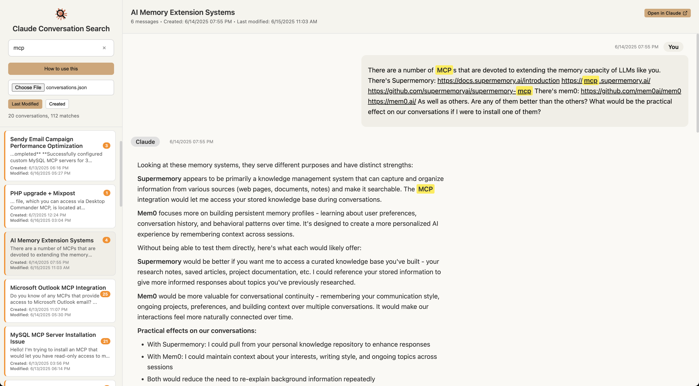

# Claude Conversation Search

Claude doesn't let you search across your conversations — but it does let you export them. This tool lets you browse through past chats and search them by keyword.

## Getting your data
- Go to https://claude.ai/settings/data-privacy-controls in your browser.
- Scroll down to the **Data controls** section. Click the **Export data** button. In the modal that appears, click **Export data** again to confirm.
- Check your email for a download link (it might take a minute or two). Download and unzip the file you receive.

## Loading, browsing, and searching your conversations
- Open up `index.html` from this repo in your browser. Click **Choose File** in the left sidebar. Navigate to your unzipped folder and select the `conversations.json` file.
- All your exported conversations will load onto the sidebar; clicking them will open them in the main pane.
- Toggling between **Last Modified** and **Created** will change the order conversations are shown in.
- Using the search box will find only chats containing your keywords.
- Clicking **Open in Claude** will open the current chat on claude.ai.

## Limitations
Claude's current export tool doesn't include Artifacts or certain blocks that show the output of tool use. Anthropic replaces them with "This block is not supported on your current device yet" or similar language. But in-chat code blocks will appear, and Claude's other Markdown formatting (bold, italic, code, lists, etc.) should render properly.

## Privacy
This all runs in your browser; your chats never leave your computer.
